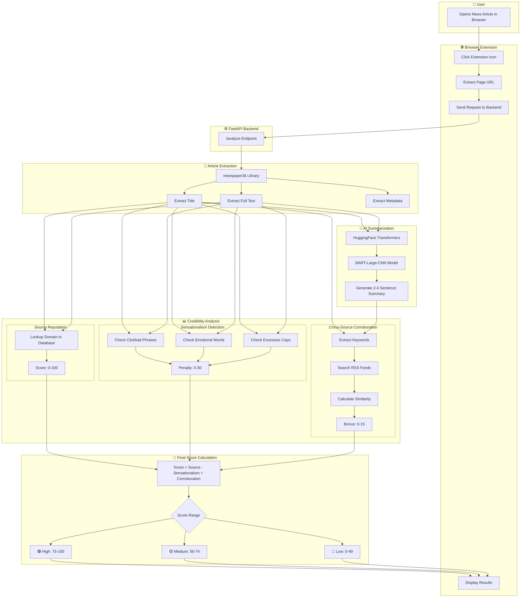
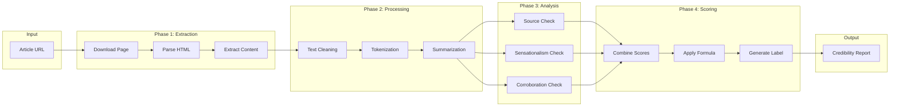
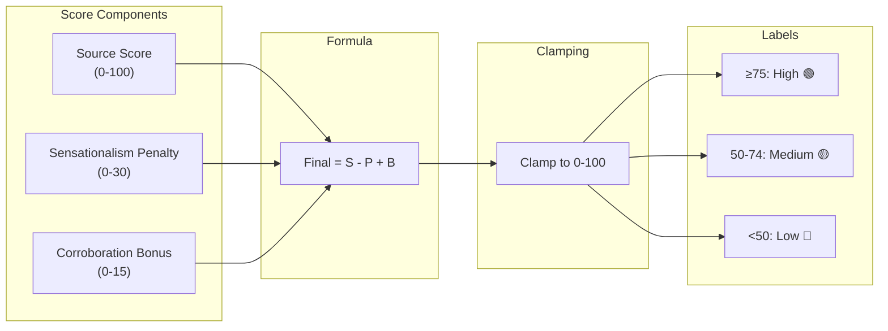
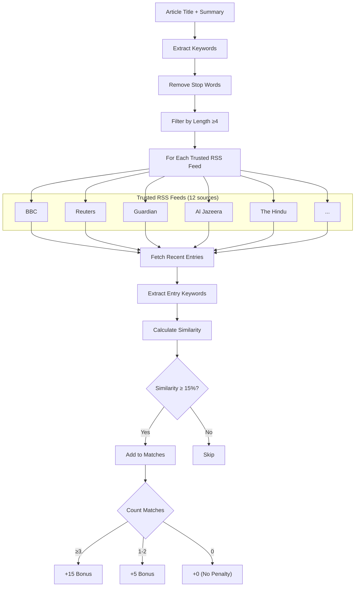
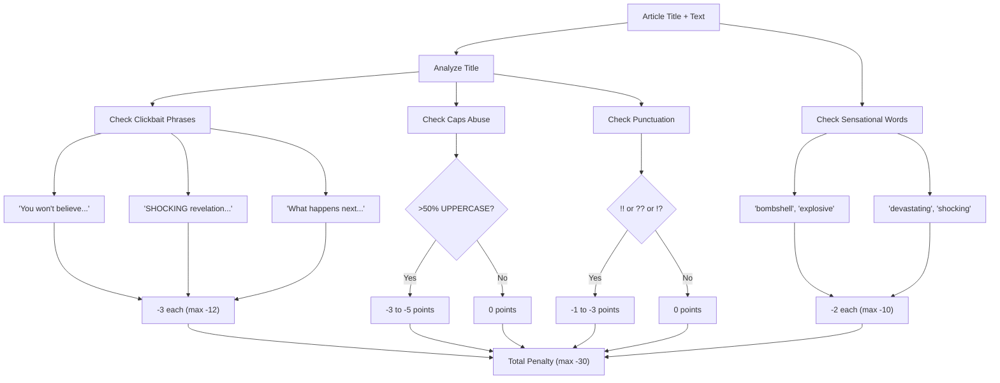

# Methodology Block Diagram

## System Architecture Overview

---

## Detailed Methodology Flow

---

## Credibility Scoring Formula

---

## Cross-Source Corroboration Process

---

## Sensationalism Detection Flow

